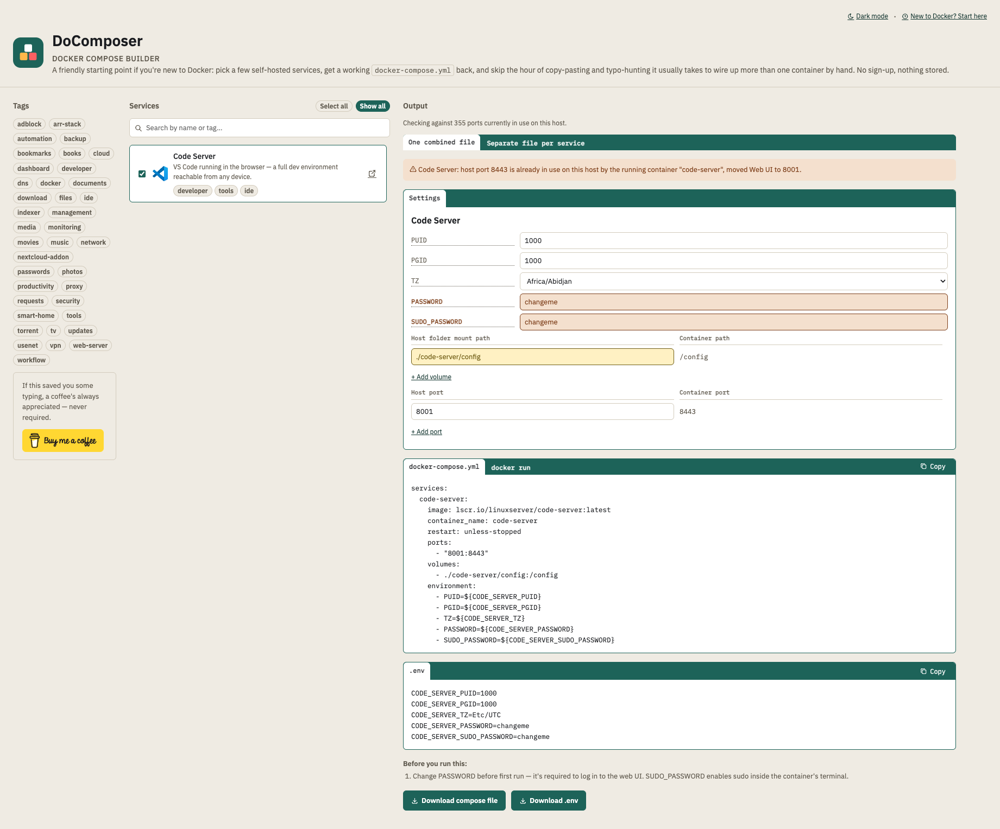

# DoComposer



**A friendly starting point if you're new to Docker.** Pick a few self-hosted
services from a checklist, get back a working `docker-compose.yml` (or the
equivalent `docker run` commands, if you'd rather see exactly what's
happening). No accounts, no backend calling home, nothing leaves your
browser except when you deploy it yourself.

It's not trying to replace hand-writing compose files once you know what
you're doing — it's meant to save the hour of copy-pasting, typo-hunting,
and looking up "what port does Jellyfin use again?" that comes with wiring
up more than one container by hand, especially while you're still learning.
New to Docker entirely? Start with [`guide.html`](guide.html) — a short,
practical intro to what Docker is, how to install it, and how to actually
run what this tool builds for you.

## What it does

- **40+ services** across media, networking, productivity, security,
  automation and container-management categories, each with real project
  icons, a homepage link, and searchable tags.
- **Search and tag filtering**, plus an "Arr Stack" bundle (Sonarr, Radarr,
  Prowlarr, qBittorrent, SABnzbd, Lidarr, Readarr, a dashboard and a request
  manager) you can add in one click and then exclude individual pieces from.
- **Editable Settings panel** — every environment variable, volume mount,
  and port is editable before you download anything: change a password
  placeholder, point a volume at your own folder, add extra volumes/ports
  a service doesn't ship with by default, or override a default port.
- **Two output formats** — a `docker-compose.yml` + `.env` pair, or the
  same setup as plain `docker run` commands, toggled per file.
- **Port-conflict detection**, including (optionally) against containers
  *already running* on the host — see [Live host-port checking](#live-host-port-checking-optional).
- A **beginner's guide** (`guide.html`) covering installing Docker on
  Windows/macOS/Linux, running the generated files, opening the result in a
  browser, and GUI alternatives (Dockge, Portainer) if you'd rather not
  touch a terminal at all.

## Try it

Open `index.html` directly in a browser, or serve the folder with any
static file server (`python3 -m http.server`, VS Code's Live Server, etc).
Live host-port checking won't be available this way — see below.

## Running it as a Docker container (in your own homelab)

There's a bit of irony in running a docker-compose generator inside Docker,
but it works fine:

```bash
docker compose up -d --build
```

Then visit `http://<your-server-ip>:8190`. To change the port, edit the
left side of the `ports` mapping in `docker-compose.yml` (e.g. `"9000:80"`).

If you'd rather use plain `docker run`:

```bash
docker build -t docomposer .
docker run -d --name docomposer \
  -p 8190:80 \
  -v /var/run/docker.sock:/var/run/docker.sock \
  --restart unless-stopped \
  docomposer
```

### Live host-port checking (optional)

The shipped `docker-compose.yml` mounts `/var/run/docker.sock` into the
container so a small background script (`poll-ports.sh`) can poll the
Docker Engine API for currently-published ports and warn if a service you
pick collides with something already running — not just with other
services in your current selection.

**This is optional but not risk-free.** A bind-mounted Docker socket
carries full API access regardless of whether the mount has a `:ro` flag —
that flag only affects filesystem operations on the socket file itself, not
which API calls can go through it. Only run this with the socket mounted on
a host you trust, the same rule as any tool that asks for it (Portainer,
Dockge, Portracker). If you'd rather not grant that, just remove the
`volumes:` block from `docker-compose.yml` — everything else works
identically, you just lose the "already running on this host" half of the
port check.

## How it's organized

- `services.js` — the data model and the actual logic. Every service is
  one object: image, ports, volumes, environment variables, tags, a
  homepage link, and optional `dependsOn` for services needing a companion
  container (Nextcloud → MariaDB, Immich → Postgres/Redis/ML, ...). This
  file also builds the compose YAML and `docker run` script, and resolves
  port conflicts.
- `app.js` — all DOM wiring: the checklist, search/tags, the Settings
  panel (including the add-volume/add-port forms), tab switching, and the
  live host-port poll.
- `index.html` / `style.css` — structure and look for the builder page.
- `guide.html` — the standalone beginner's guide, linked from the header.
- `poll-ports.sh` / `start.sh` — the background port poller and the
  container entrypoint that starts it alongside nginx.
- `Dockerfile` / `docker-compose.yml` — packages the whole thing as a
  static site served by nginx, plus the poller's dependencies (`curl`,
  `jq`).

## Adding a new service

Add an object to `SERVICES` in `services.js` with `name`, `icon` (a URL —
this project uses the [homarr-labs/dashboard-icons](https://github.com/homarr-labs/dashboard-icons)
set), `homepage`, `image`, `description`, `tags`, `ports`, `volumes`, and
`environment`. It appears in the checklist, search, and tag filters
automatically — no changes needed anywhere else. Use `changeme`-prefixed
default values for anything that must be replaced before first run (a
password, a signing key); the Settings panel highlights those automatically
and won't let the tooltip lie about what's still a placeholder.

## Known limitations (good candidates for a v2)

- Compose YAML is hand-built as strings, not through a YAML library — fine
  while the shape is this simple, but worth revisiting if the schema grows
  (networks, healthchecks, multiple compose profiles).
- No "troubleshoot my existing compose file" mode — parsing and diagnosing
  arbitrary YAML is a meaningfully harder problem than generating it.
- Host-port checking only sees what's running on the Docker host this
  container itself has socket access to — it won't know about ports used
  by non-Docker processes, or containers on a different host.
- Icons and screenshots for a few niche services are either a plain
  initial-letter placeholder or a reasonable stand-in (e.g. DockFlare uses
  the `cloudflared` icon it wraps) where no dedicated logo exists in the
  icon set used.

## Support

If this saved you some time, there's a "buy me a coffee" link at the
bottom of the builder page — never required, always appreciated.

## License

[MIT](LICENSE)
